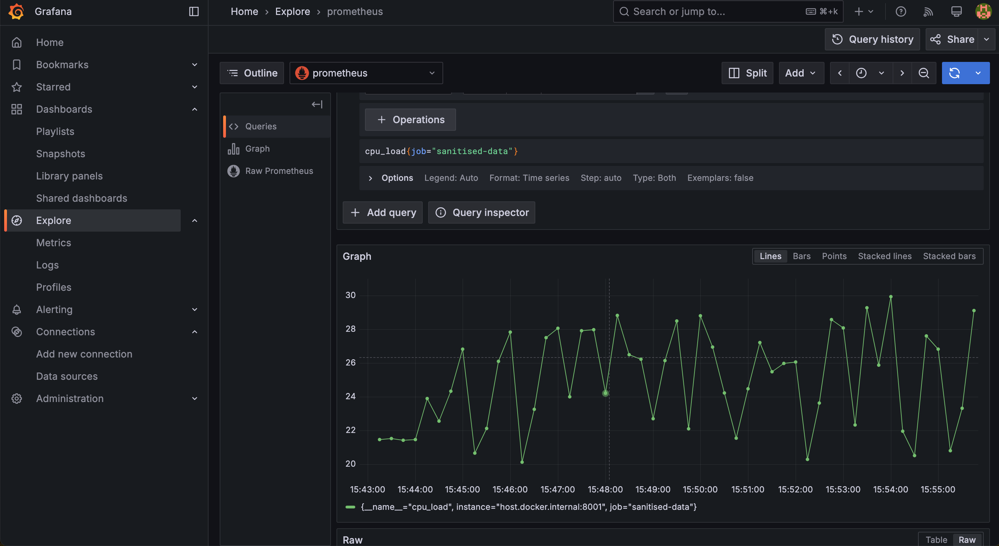

# 🐕 Monitoring Simulation Data with Loki, Prometheus & Grafana

<p align="center">
  
</p>

## 🚀 Overview
This guide explains how to set up **Loki**, **Prometheus**, and **Grafana** using Docker Compose to monitor CPU load data from a Python application locally.

🔹 **Prometheus** - Scrapes metrics from the app  
🔹 **Loki** - Collects & indexes logs  
🔹 **Grafana** - Visualizes the data  

---

## 📌 Prerequisites
Ensure you have the following installed:
- [Docker & Docker Compose](https://docs.docker.com/get-docker/)
- [Colima](https://github.com/abiosoft/colima) (for Mac users)
- [kind](https://kind.sigs.k8s.io/)
- [kubectl](https://kubernetes.io/docs/reference/kubectl/)

If Mac user run the following script to install the tools:
```bash
brew install colima
colima start
brew install kind
brew install kubectl
```

---

## 🚀 Start the Monitoring Stack
### With Docker Compose or `kind`
Run the following command to build and start the services:

```bash
docker compose up --build
```
or


```bash
bash kind-setup.sh
```

---

## 📊 Connect Grafana to Prometheus
1. Open **Grafana UI** → [http://localhost:3000](http://localhost:3000)
2. **Login** with:
   - Username: `admin`
   - Password: `admin`
3. Navigate to **"Configuration" > "Data Sources"**
4. Click **"Add Data Source"** and select **Prometheus**
5. Set the **URL**:

   ```
   http://prometheus:9090
   ```

6. Click **"Save & Test"** 🎯

---

## 📈 Create a Grafana Dashboard
1. Go to **"Create" > "Dashboard"**
2. Click **"Add a new panel"**
3. In the **Metrics** section, enter:

   ```promql
   cpu_load
   ```

4. Click **"Run query"** to visualize CPU load
5. Customize the graph, then click **"Save"** ✅

---

## 📜 Configure Loki for Log Monitoring
1. Navigate to **"Logs"** in Grafana
2. Select **"Loki"** as the **"Data Source"**
3. Set the **URL**:

   ```
   http://loki:3100
   ```

4. Run a log query to filter logs:

   ```logql
   {app="sanitised-data"}
   ```

---

## 🎉 Done!  
Your **sanitised-data service** is now fully monitored with **Prometheus, Loki & Grafana**! 🚀  

✅ **Metrics →** Tracked via **Prometheus**  
✅ **Logs →** Indexed with **Loki**  
✅ **Visualization →** Displayed in **Grafana**  

---
